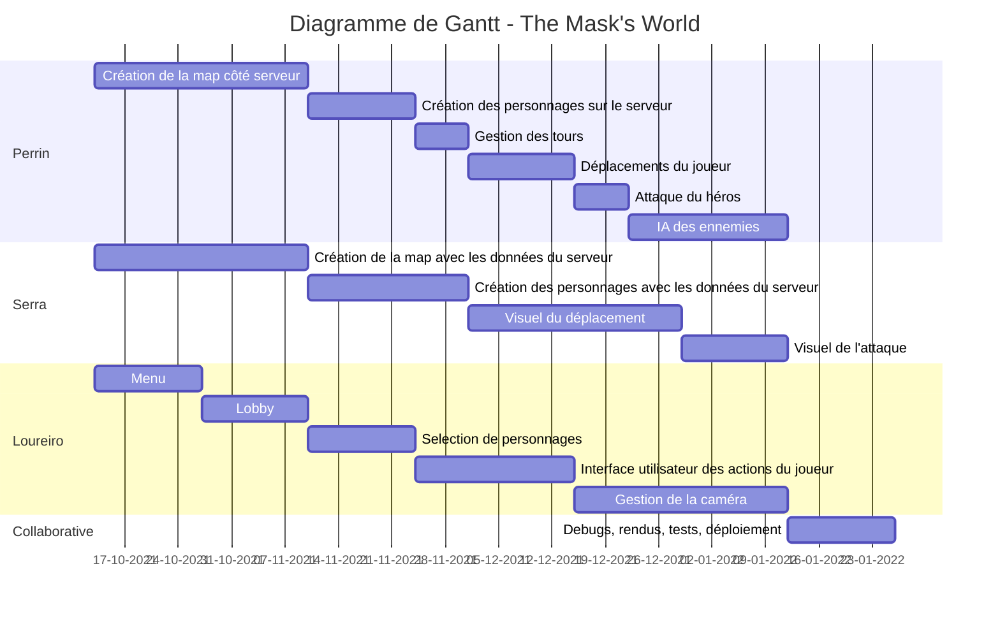

# VR_Fruit_Ninja

```mermaid
gantt
    title Diagramme de Gantt - The Mask's World
    dateFormat  DD-MM-YYYY
    axisFormat  %d-%m-%Y
    todayMarker stroke-width:5px,stroke:#0f0,opacity:0.5
    
    section Perrin
    Création de la map côté serveur : p1, 13-10-2021, 4w
    Création des personnages sur le serveur :p2, after p1,  2w
    Gestion des tours: p3, after p2, 1w
    Déplacements du joueur: p4, after p3, 2w
    Attaque du héros: p5, after p4, 1w
    IA des ennemies: p6, after p5, 3w
    
    section Serra
    Création de la map avec les données du serveur: s1, 13-10-2021, 4w
    Création des personnages avec les données du serveur :s2, after s1  , 3w
    Visuel du déplacement: s3, after s2, 4w
    Visuel de l'attaque: s4, after s3, 2w
    
    section Loureiro
    Menu    :l1, 13-10-2021, 2w
    Lobby     :l2, after l1  , 2w
    Selection de personnages :l3, after l2  , 2w
    Interface utilisateur des actions du joueur: l4, after l3, 3w
    Gestion de la caméra : l5, after l4, 4w
    
    section Collaborative
    Debugs, rendus, tests, déploiement : c1, after p6, 2w
    
```
